# A Layered Approach for Multi-Agent Path Finding

Simulation platform of a Layered Approach for Multi-Agent Path Finding (MAPF).

## 1. Introduction

*Layered MAPF* is a newly proposed algorithm for solving Multi-Agent Path Finding (MAPF) problems. This algorithm adopts a **hybrid cloud-edge-terminal architecture**, which consists of one centralized cloud server and multiple decentralized edge servers and terminals (robots). The robots plan their path using a two-level A* algorithm guided by **heat maps**, improving computing efficiency and avoiding most potential conflicts.

## 2. Demo

* **2D Simulation View**

  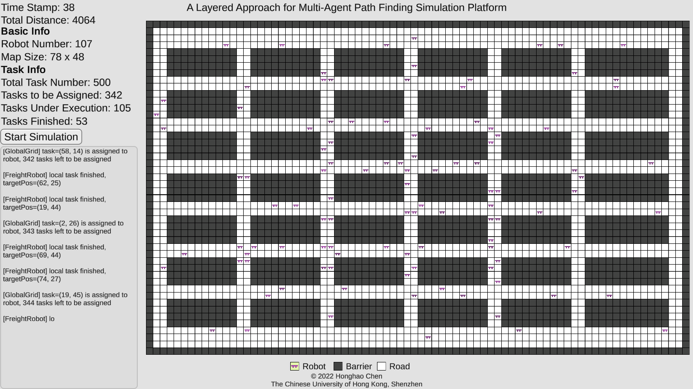

* **3D Simulation View**

  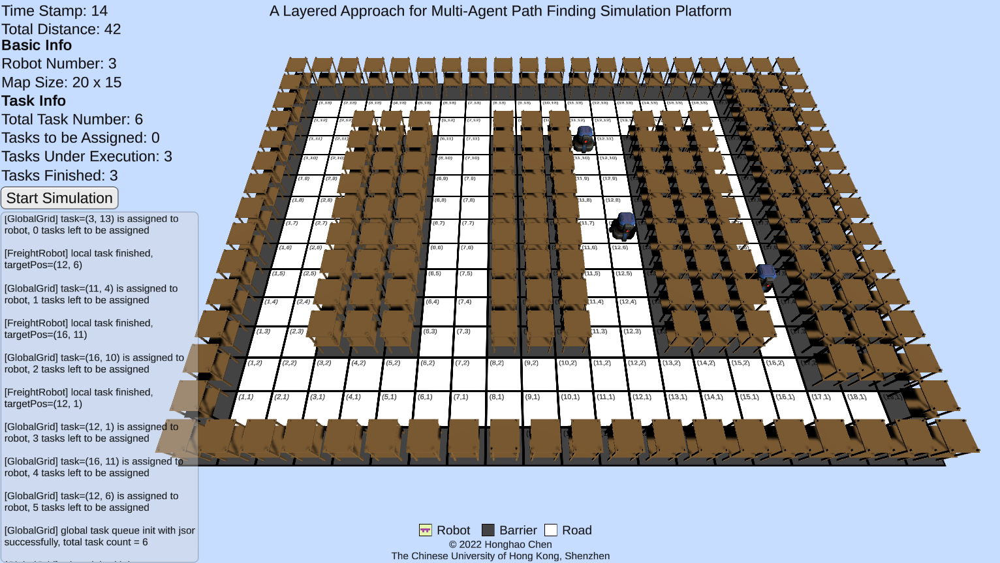

* **Heat Map Visualizer**

  * Heat Map using T-Shape Generation Algorithm

    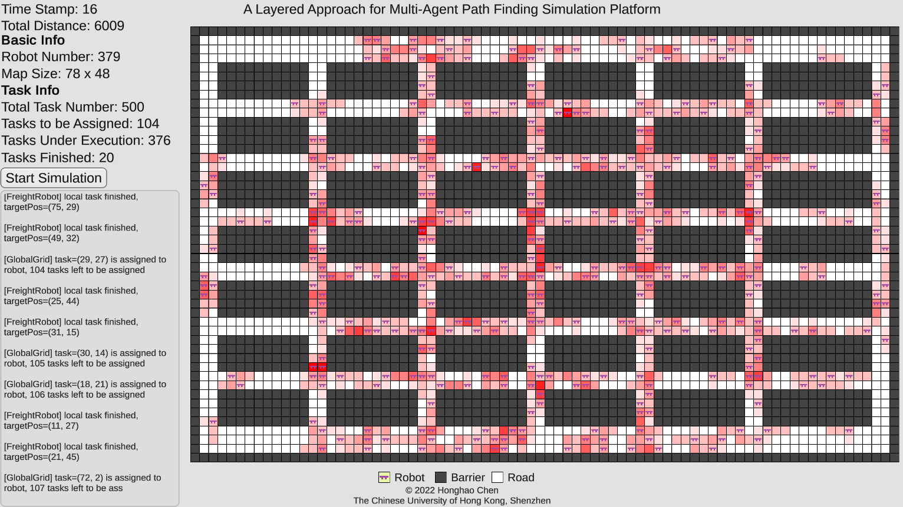

  * Heat Map using Circle-Gaussian Generation Algorithm

    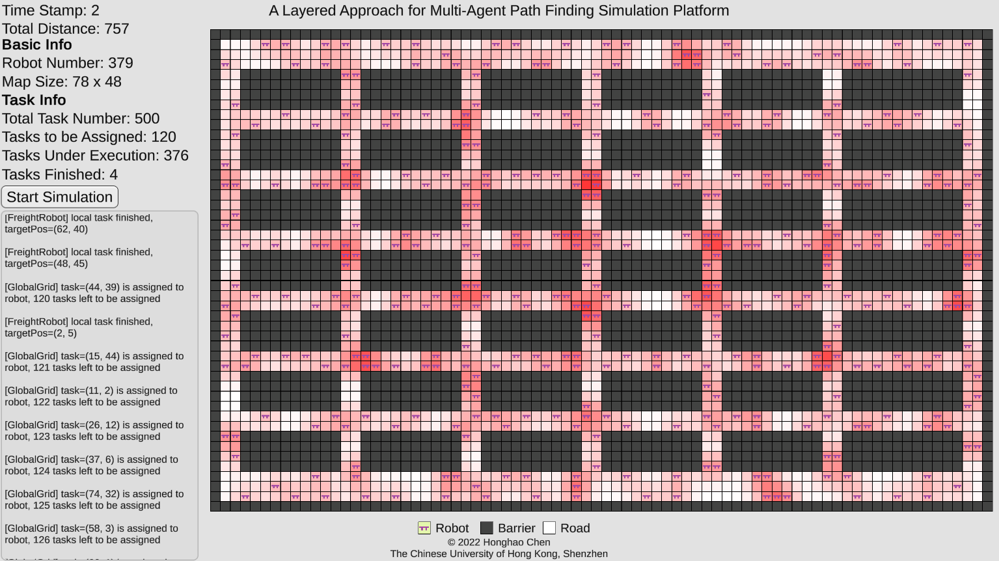

* **Map Editor**

  Edit grid map with MS Excel and save as `csv` files.

  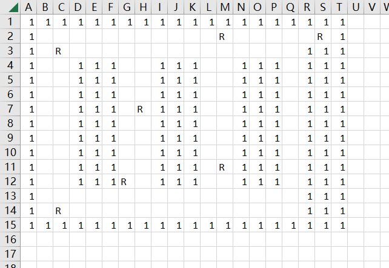

* **Map Converter**

  Convert `csv` maps (including robot arrangements) to `json` files. The simulation program will read `json` files at runtime before the simulation begins.

  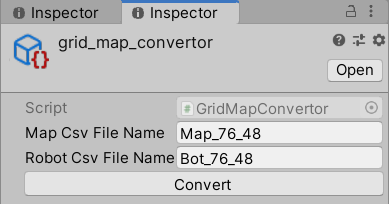

* **Random Task Generator**

  Generate random tasks given the `json` maps and corresponding robot arrangements.

  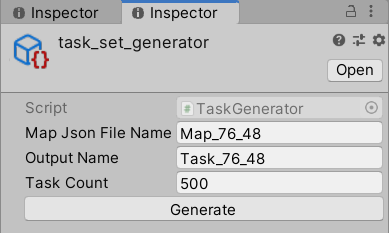

## 3. Algorithm Architecture

**Layered Architecture:**

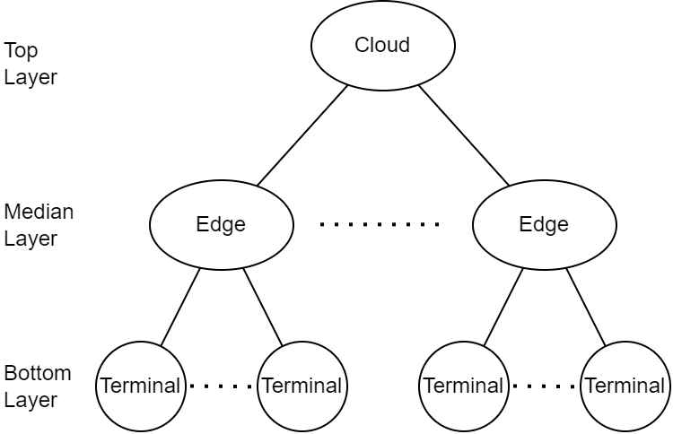

**Flow Chart:**

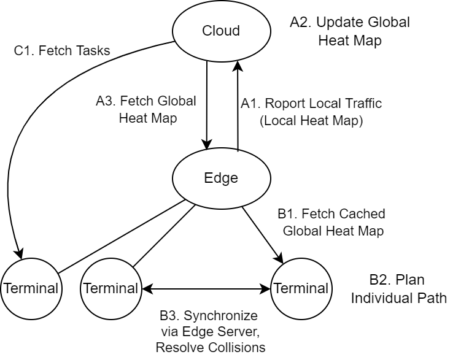

### 3.1 Offline Preprocessing Phase

Original Map:

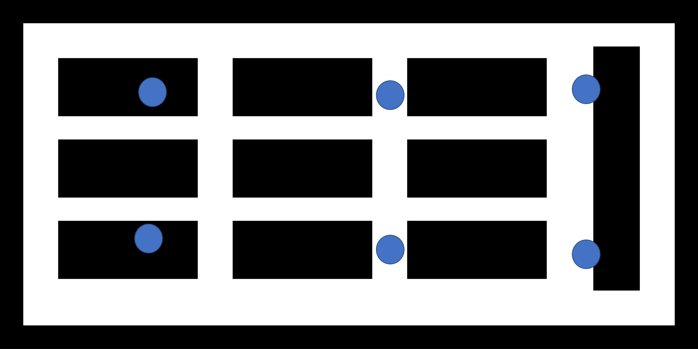

Partitioned Map and Topological Map: 

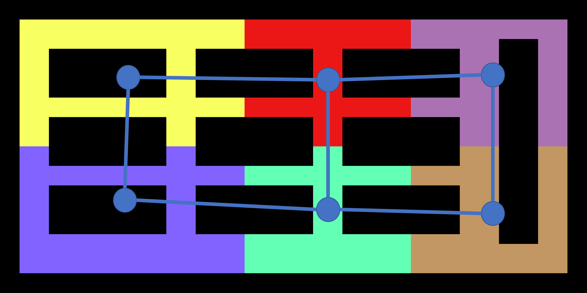

### 3.2 Online Scheduling Phase

Online Scheduling Phase: Two-level A* algorithm guided by **heat maps**

* Heat Map Generation (For one single agent):

  * T-Shape Generation Algorithm is shown as an example.

  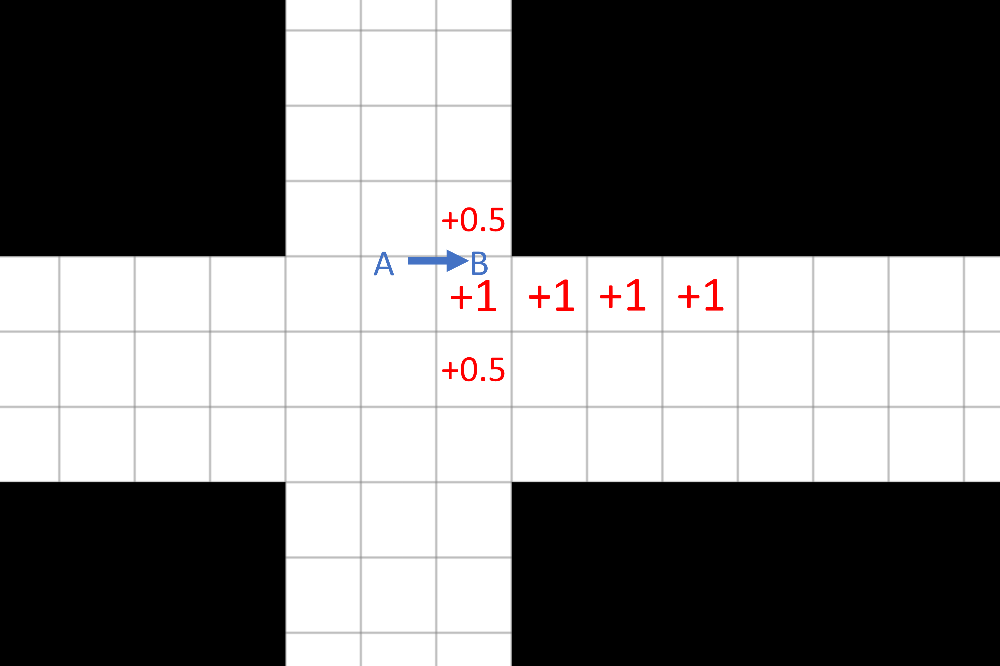

* Complete Heat Map (with all agents included):

  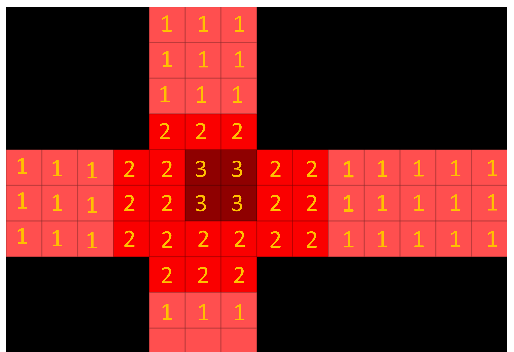

## 4. Environment

* Unity 2019.4.5f1